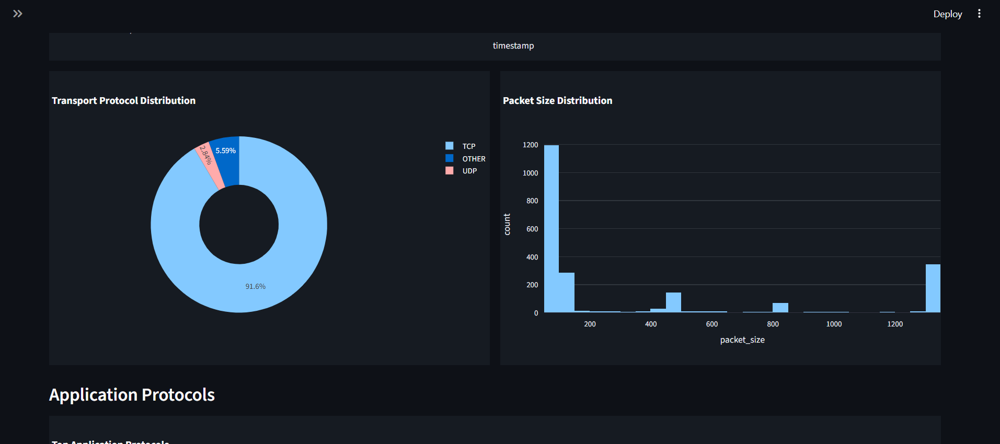
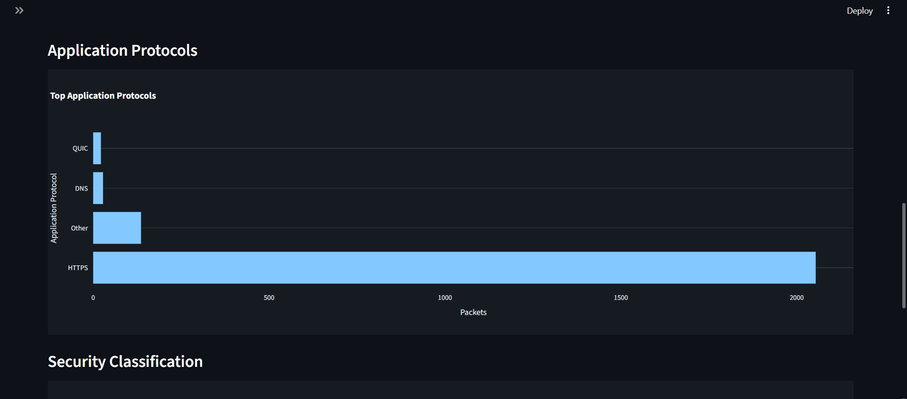
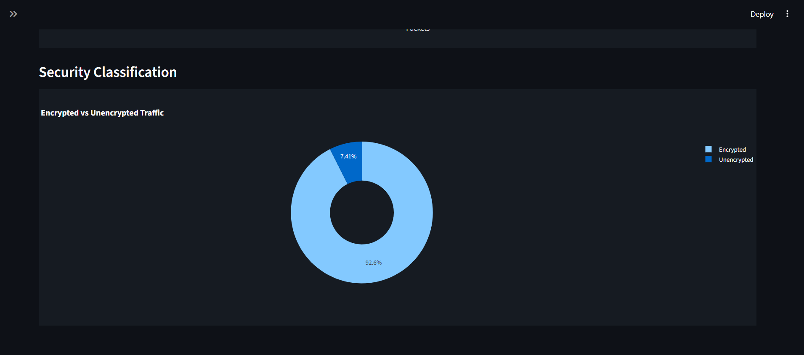

# Network Traffic Analyser

A real-time **network traffic monitoring and analysis tool** built using **Python, Scapy, and Streamlit**.  
The system captures live packets, classifies traffic across multiple layers, measures DNS latency, and visualises insights through an interactive dark-mode dashboard.

This project focuses on **systems programming, networking fundamentals, and security observability**, making it suitable for academic use, portfolios, and interviews.

---

## Features

### Live Packet Capture
- Real-time packet sniffing using **Scapy**
- Supports **TCP, UDP, and ICMP** traffic
- Saves raw traffic in **PCAP format** for offline analysis

### Traffic Classification
- **Transport Layer:** TCP, UDP, ICMP  
- **Application Layer:** HTTP, HTTPS, DNS, SSH, FTP, QUIC  
- **Security Layer:** Encrypted vs Unencrypted traffic  
- Automatic grouping of low-frequency protocols

### DNS Latency Measurement
- Tracks DNS query–response pairs
- Calculates **DNS latency in milliseconds**
- Useful for network performance analysis

### Detection Hooks
- High traffic detection
- Packet size anomaly detection
- DDoS rate monitoring
- Blacklist-based IP detection (extensible)

### Interactive Dashboard
- Live traffic rate visualisation
- Protocol and application-level breakdown
- Encrypted vs unencrypted traffic analysis
- Top talkers and raw traffic inspection
- Modern dark-mode UI built with **Streamlit**

---
## Traffic Rate Overview


## Transport and Packet Statistics


## Application Protocol Details


## Alerts & Suspicious Activity



## Architecture

```mermaid
flowchart TD
    A[Live Network Traffic] --> B[Scapy Packet Sniffer]
    B --> C[Protocol Parsing<br/>(TCP / UDP / ICMP)]
    C --> D[Traffic Classification<br/>Transport · Application · Security]
    D --> E[DNS Latency Measurement]
    D --> F[Detection Hooks<br/>High Traffic · DDoS · Anomalies]
    E --> G[CSV Logger<br/>traffic_log.csv]
    F --> G
    G --> H[Streamlit Dashboard]
    H --> I[Live Visualizations<br/>Charts · Metrics · Logs]
```
---

## Tech Stack

- **Python**
- **Scapy** – Packet capture and protocol parsing
- **Streamlit** – Interactive web dashboard
- **Pandas** – Data processing and aggregation
- **Plotly** – Interactive visualizations
- **Npcap** – Packet capture backend (Windows)

---

## Installation

### Prerequisites
- Python 3.9+
- Administrator/root privileges (for packet sniffing)
- **Npcap** installed (Windows users)

### Setup
```bash
git clone https://github.com/maryam-rahat/sniffer.git
cd sniffer
pip install -r requirements.txt
